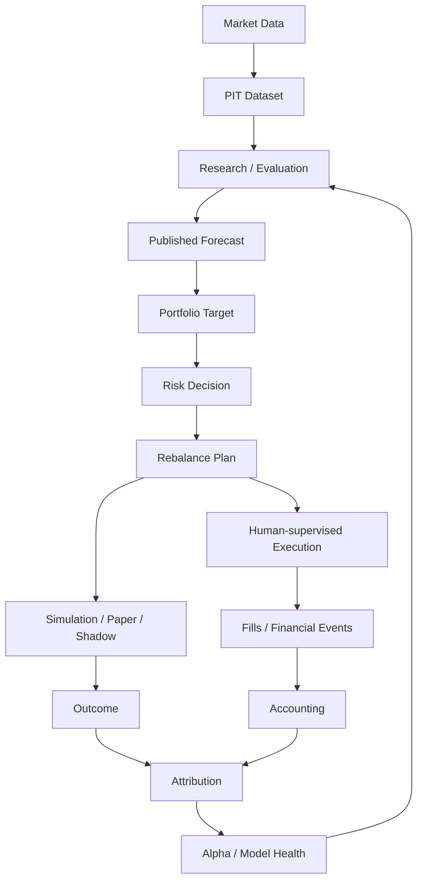

<div align="center">

# Karkinos

**Local-first quantitative research and investing platform for the China market.**

*Investing is a chronic condition. Here is your scalpel.*

[简体中文](README.zh.md) · [Documentation](docs/README.md) · [Releases](https://github.com/imReese/Karkinos/releases)

[](https://github.com/imReese/Karkinos/actions/workflows/dev-ci.yml)
[](https://github.com/imReese/Karkinos/releases)
[](LICENSE)

</div>

Karkinos turns China-market data into point-in-time research evidence, portfolio targets,
simulation results, accounting state, attribution, and continuous research feedback.

## What works today

- **Data** — China-market provider integration, local persistence, trading calendars, and point-in-time research inputs.
- **Research** — backtesting, transaction-cost modeling, parameter exploration, out-of-sample evaluation, and robustness analysis.
- **Portfolio** — portfolio targets, valuation, fees, return accounting, and reconciliation workflows.
- **Evaluation** — backtest, paper, shadow, and risk-gated simulation workflows.
- **AI-assisted research** — optional API-backed research assistance with deterministic quantitative and financial results.
- **Web application** — FastAPI backend with a React / TypeScript interface and local runtime.

Current development focus: [docs/PLAN.md](docs/PLAN.md)

## Workflow



## Core properties

- **Point-in-time research** — research inputs reflect information available at the modeled decision time.
- **Reproducible evidence** — results remain tied to data, assumptions, parameters, and time boundaries.
- **After-cost evaluation** — fees, taxes, turnover, liquidity, and execution assumptions are part of research where they matter.
- **Portfolio before orders** — predictive output becomes portfolio intent before execution intent.
- **China-market semantics** — calendars, suspensions, price limits, lot rules, and other market constraints are first-class inputs.
- **Continuous feedback** — outcomes feed attribution and Alpha / Model health back into research.
- **AI-assisted, not AI-authoritative** — AI may accelerate research iteration; Karkinos owns quantitative and financial truth.
- **Local-first ownership** — core research artifacts, portfolio state, and primary calculations remain locally owned.

## Quick start

Requirements: **Python 3.12+**, **Node.js 24.x**, **uv**, and **Git**.

```bash
git clone https://github.com/imReese/Karkinos.git
cd Karkinos
git switch dev
./scripts/start_server.sh dev
```

Open `http://127.0.0.1:5173`.

Stop the development runtime:

```bash
./scripts/stop_server.sh dev
```

Runtime and maintenance commands: [scripts/README.md](scripts/README.md)

## Documentation

- [Goal](docs/GOAL.md) — product direction and boundaries
- [Architecture](docs/ARCHITECTURE.md) — domain ownership and system design
- [Plan](docs/PLAN.md) — current development focus
- [Engineering](docs/ENGINEERING.md) — current codebase and engineering constraints
- [Guides](docs/guides/) — configuration and financial semantics
- [References](docs/REFERENCES.md) — upstream quantitative design references

## Project

**Technology:** Python · FastAPI · SQLite · React · TypeScript · Vite

**Contributing:** [CONTRIBUTING.md](CONTRIBUTING.md) · **Security:** [SECURITY.md](SECURITY.md) · **License:** [MIT](LICENSE)

Karkinos is research and investing software, not investment advice or a guarantee of returns.
