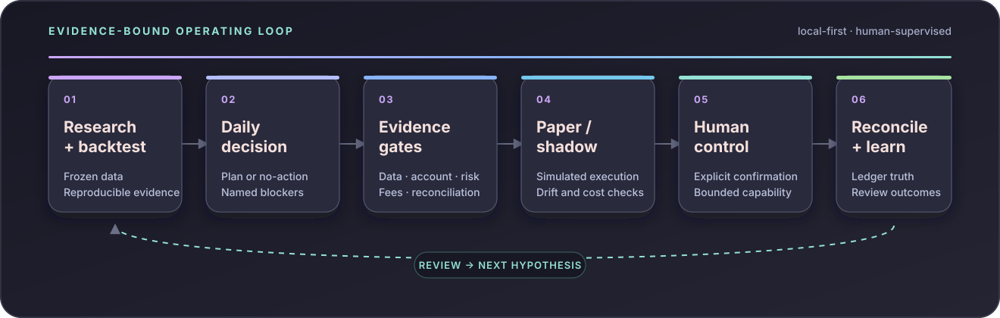
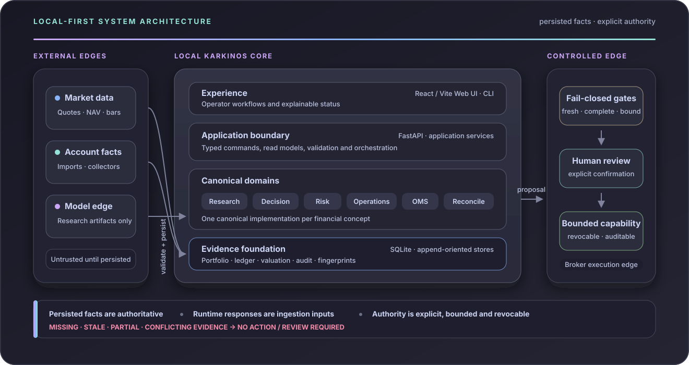

# Karkinos

> Investing is a chronic condition. Here is your scalpel.
>
> 投资是一种慢性病。这是你的手术刀。

Karkinos is a local-first quantitative investing platform. It connects
reproducible research, persisted portfolio evidence, risk controls, daily
decisions, paper/shadow validation, reconciliation, and human-supervised
execution in one auditable workflow.

[中文文档](docs/README.zh.md) · [English docs](docs/README.en.md) ·
[Roadmap](docs/ROADMAP.md) · [Architecture](docs/ARCHITECTURE.md) ·
[Latest release](https://github.com/imReese/Karkinos/releases/latest)

## Investment operating loop



Every transition preserves its inputs, identity, limitations, and blockers.
Missing, stale, partial, ambiguous, or conflicting financial evidence remains
visible and fails closed.

## Architecture



Provider, model, and broker responses enter through explicit boundaries.
Authoritative reads consume persisted facts; they do not silently refresh data
or grant execution authority. See the [Architecture](docs/ARCHITECTURE.md) for
canonical ownership, invariants, and failure semantics.

## Core capabilities

- Reproducible backtests with frozen datasets, modeled costs, OOS evidence,
  comparisons, parameter sweeps, and strategy review.
- Persisted portfolio, ledger, valuation, market-data, Account Truth, and
  reconciliation evidence with explicit freshness and provenance.
- Daily decisions and trading plans that include buy, sell, hold, rebalance,
  no-action, and review-required outcomes.
- Paper Broker, OMS, paper/shadow validation, signal journals, and
  post-decision review.
- Mandatory data, account, risk, fee, strategy, reconciliation, and operator
  gates before live-like actions.
- Evidence-bound AI research whose output remains non-authoritative and cannot
  grant trading or capital authority.

## Safety by design

Karkinos is research and operating software, not investment advice or a return
guarantee.

- Real-money submission is disabled by default.
- Strategy and AI code cannot call a broker directly.
- Live-like actions require explicit, bounded, revocable human authority.
- Read endpoints do not silently contact providers or mutate financial facts.
- Broker credentials, account exports, runtime databases, logs, and private
  screenshots must never enter source control.

## Project status

The latest tagged release is
[v0.1.0](https://github.com/imReese/Karkinos/releases/tag/v0.1.0). Karkinos is
under active development; the tagged release is the stable local baseline,
while `main` continues to evolve.

Research, backtesting, portfolio evidence, daily planning, paper/shadow, OMS,
reconciliation, and the provider-neutral controlled-execution foundation are
implemented. Selecting, accepting, and deploying a real broker adapter remains
an explicit owner decision.

See the [Roadmap](docs/ROADMAP.md) for active priorities and the
[Implementation Log](docs/IMPLEMENTATION_LOG.md) for completed evidence. Those
details intentionally do not live in this README.

## Quick start

Requirements: Python 3.12+, Node.js 24.x, `uv`, and optionally Docker.

```bash
cp config.example.json config.json
cp .env.example .env
uv sync --extra server --extra dev --frozen
npm ci --prefix web
npm --prefix web run build
uv run python -m server --check-config
uv run python -m server --no-live
```

Open `http://127.0.0.1:8000`. The `--no-live` startup is intentionally safe: it
does not enable the background live scheduler.

For local development:

```bash
./scripts/start_server.sh dev --host 127.0.0.1 --port 8000
```

Use fake or sanitized development data. Keep `config.json`, `.env`, runtime
databases, and private account evidence local.

## Verification

```bash
uv run python -m pytest
npm --prefix web run format:check
npm --prefix web run test
npm --prefix web run build
```

Docker runtime:

```bash
docker compose up --build
```

## Documentation map

- [Product goal](docs/KARKINOS_GOAL.md) — North Star and durable boundaries.
- [Roadmap](docs/ROADMAP.md) — milestones, priorities, and release gates.
- [Architecture](docs/ARCHITECTURE.md) — canonical ownership and failure
  semantics.
- [English documentation](docs/README.en.md) / [中文文档](docs/README.zh.md) —
  setup, workflows, configuration, and operator guides.
- [AI collaboration policy](AI_COLLABORATION.md) — integrity, authority, and
  validation rules for assisted work.

## Technology

Python · FastAPI · SQLite · React · TypeScript · Vite · Docker

## License

MIT
