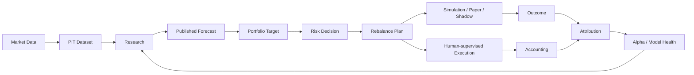

<table width="100%">
<tr>
<td align="center">

<h1>Karkinos</h1>

<strong>Local-first quantitative research and investing platform for China markets.</strong>

<br><br>

<em>Investing is a chronic condition. Here is your scalpel.</em>

<br><br>

<a href="docs/README.md">Documentation</a> · <a href="docs/PLAN.md">Plan</a> · <a href="https://github.com/imReese/Karkinos/releases">Releases</a> · <a href="README.zh.md">简体中文</a>

<br><br>

<a href="https://github.com/imReese/Karkinos/actions/workflows/ci.yml"></a>
<a href="https://github.com/imReese/Karkinos/releases"></a>
<a href="LICENSE"></a>

</td>
</tr>
</table>

Karkinos connects point-in-time market data, reproducible research, portfolio construction,
risk, simulation, accounting, and attribution in one local-first workflow.

## Highlights

- **Point-in-time data** — research inputs reflect information available at the modeled decision time.
- **Research** — backtesting, transaction-cost modeling, parameter exploration, out-of-sample evaluation, and robustness analysis.
- **Portfolio & risk** — published forecasts become portfolio targets, explicit risk decisions, and rebalance plans before execution.
- **Evaluation** — backtest, paper, and shadow workflows connect research expectations with later outcomes.
- **China-market semantics** — trading calendars, suspensions, price limits, lot rules, fees, and taxes are first-class concerns.
- **Local-first** — core research artifacts, portfolio state, financial state, and primary calculations remain locally owned.
- **AI-assisted research** — optional AI can accelerate research iteration while deterministic code owns quantitative and financial results.
- **Web application** — FastAPI backend with a React / TypeScript interface and local runtime.

## Research-to-portfolio loop



## Development quick start

Requirements: **Python 3.12+**, **Node.js 24.x**, **uv**, and **Git**.

```bash
git clone https://github.com/imReese/Karkinos.git
cd Karkinos
git switch dev
./scripts/start_server.sh dev
```

Open `http://127.0.0.1:5173`.

```bash
./scripts/stop_server.sh dev
```

Packaged builds: [Releases](https://github.com/imReese/Karkinos/releases) · Runtime and maintenance commands: [scripts/README.md](scripts/README.md)

## Documentation

- [Goal](docs/GOAL.md) — product direction and boundaries
- [Architecture](docs/ARCHITECTURE.md) — domain ownership and system design
- [Plan](docs/PLAN.md) — current development focus
- [Engineering](docs/ENGINEERING.md) — codebase reality and engineering constraints
- [Guides](docs/guides/) — configuration and financial semantics

## Project

Python · FastAPI · SQLite · React · TypeScript · Vite

[Contributing](CONTRIBUTING.md) · [Security](SECURITY.md) · [MIT License](LICENSE)

Karkinos is research and investing software, not investment advice or a guarantee of returns.
