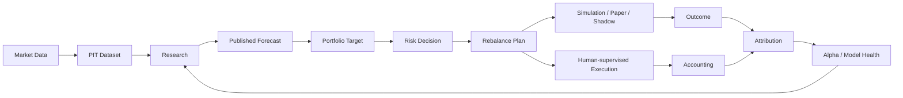

<div align="center">

<h1>Karkinos</h1>

<p><strong>面向中国市场、本地优先的量化研究与投资平台。</strong></p>

<p><em>投资是一种慢性病。这是你的手术刀。</em></p>

<p>
  <a href="https://github.com/imReese/Karkinos/actions/workflows/ci.yml"></a>
  <a href="https://github.com/imReese/Karkinos/releases"></a>
  <a href="LICENSE"></a>
</p>

<p>
  <a href="docs/README.md">文档</a> ·
  <a href="docs/ARCHITECTURE.md">架构</a> ·
  <a href="https://github.com/imReese/Karkinos/releases">Releases</a> ·
  <a href="README.md">English</a>
</p>

</div>

Karkinos 将 point-in-time 市场数据、可复现研究、组合构建、风险、模拟、会计和归因连接成一条本地优先的工作流。

## 核心能力

- **Point-in-time 数据** — 研究输入只使用建模决策时点真正可获得的信息。
- **Research** — 回测、交易成本建模、参数探索、样本外评估和稳健性分析。
- **Portfolio & Risk** — 已发布预测先形成组合目标，再经过明确的风险决策和再平衡计划进入执行。
- **Evaluation** — backtest、paper 和 shadow 工作流用于连接研究预期与后续结果。
- **中国市场语义** — 交易日历、停牌、涨跌停、交易单位、费用和税费是一等约束。
- **Local-first** — 核心研究产物、组合状态、金融状态和主要计算默认由本地持有。
- **AI-assisted Research** — 可选 AI 用于加速研究迭代，量化和金融结果由确定性代码持有。
- **Web App** — FastAPI 后端、React / TypeScript 界面和本地运行环境。

## 从研究到组合



## 开发快速开始

环境要求：**Python 3.12+**、**Node.js 24.x**、**uv** 和 **Git**。

```bash
git clone https://github.com/imReese/Karkinos.git
cd Karkinos
git switch dev
./scripts/start_server.sh dev
```

打开 `http://127.0.0.1:5173`。

```bash
./scripts/stop_server.sh dev
```

发布版本：[Releases](https://github.com/imReese/Karkinos/releases) · 运行与维护命令：[scripts/README.md](scripts/README.md)

## 文档

- [Goal](docs/GOAL.md) — 产品方向和边界
- [Architecture](docs/ARCHITECTURE.md) — 领域 ownership 和系统设计
- [Plan](docs/PLAN.md) — 当前开发重点
- [Engineering](docs/ENGINEERING.md) — 当前代码库和工程约束
- [Guides](docs/guides/) — 配置和金融语义

## 项目

Python · FastAPI · SQLite · React · TypeScript · Vite

[贡献](CONTRIBUTING.md) · [安全](SECURITY.md) · [MIT License](LICENSE)

Karkinos 是量化研究与投资软件，不构成投资建议，也不保证任何收益。
