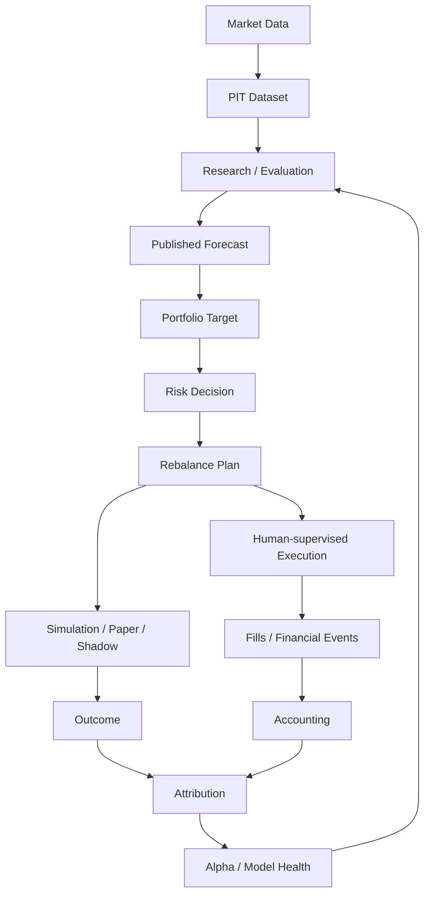

<div align="center">

# Karkinos

**面向中国市场、本地优先的量化研究与投资平台。**

*投资是一种慢性病。这是你的手术刀。*

[English](README.md) · [文档](docs/README.md) · [Releases](https://github.com/imReese/Karkinos/releases)

[](https://github.com/imReese/Karkinos/actions/workflows/dev-ci.yml)
[](https://github.com/imReese/Karkinos/releases)
[](LICENSE)

</div>

Karkinos 将中国市场数据转化为 point-in-time 研究证据、组合目标、模拟结果、会计状态、归因和持续研究反馈。

## 当前能力

- **Data** — 中国市场数据源接入、本地持久化、交易日历和 point-in-time 研究输入。
- **Research** — 回测、交易成本建模、参数探索、样本外评估和稳健性分析。
- **Portfolio** — 组合目标、估值、费用、收益核算和对账工作流。
- **Evaluation** — backtest、paper、shadow 和经过风险约束的模拟工作流。
- **AI-assisted Research** — 可选的 API 辅助研究，量化和金融结果由确定性代码计算。
- **Web App** — FastAPI 后端、React / TypeScript 界面和本地运行环境。

当前开发重点：[docs/PLAN.md](docs/PLAN.md)

## 工作流



## 核心特性

- **Point-in-time research** — 研究只使用建模决策时点真正可获得的信息。
- **Reproducible evidence** — 结果绑定数据、假设、参数和时间边界。
- **After-cost evaluation** — 在相关研究中计入费用、税费、换手、流动性和执行假设。
- **Portfolio before orders** — 预测先形成组合意图，再形成执行意图。
- **China-market semantics** — 交易日历、停牌、涨跌停、交易单位等市场约束是一等输入。
- **Continuous feedback** — 结果通过归因和 Alpha / Model Health 回流研究。
- **AI-assisted, not AI-authoritative** — AI 可以加速研究迭代，量化和金融事实由 Karkinos 持有。
- **Local-first ownership** — 核心研究产物、组合状态和主要计算默认由本地持有。

## 快速开始

环境要求：**Python 3.12+**、**Node.js 24.x**、**uv** 和 **Git**。

```bash
git clone https://github.com/imReese/Karkinos.git
cd Karkinos
git switch dev
./scripts/start_server.sh dev
```

打开 `http://127.0.0.1:5173`。

停止开发环境：

```bash
./scripts/stop_server.sh dev
```

运行与维护命令：[scripts/README.md](scripts/README.md)

## 文档

- [Goal](docs/GOAL.md) — 产品方向和边界
- [Architecture](docs/ARCHITECTURE.md) — 领域 ownership 和系统设计
- [Plan](docs/PLAN.md) — 当前开发重点
- [Engineering](docs/ENGINEERING.md) — 当前代码库和工程约束
- [Guides](docs/guides/) — 配置和金融语义
- [References](docs/REFERENCES.md) — 上游量化项目设计参考

## 项目

**技术栈：** Python · FastAPI · SQLite · React · TypeScript · Vite

**贡献：** [CONTRIBUTING.md](CONTRIBUTING.md) · **安全：** [SECURITY.md](SECURITY.md) · **License：** [MIT](LICENSE)

Karkinos 是量化研究与投资软件，不构成投资建议，也不保证任何收益。
